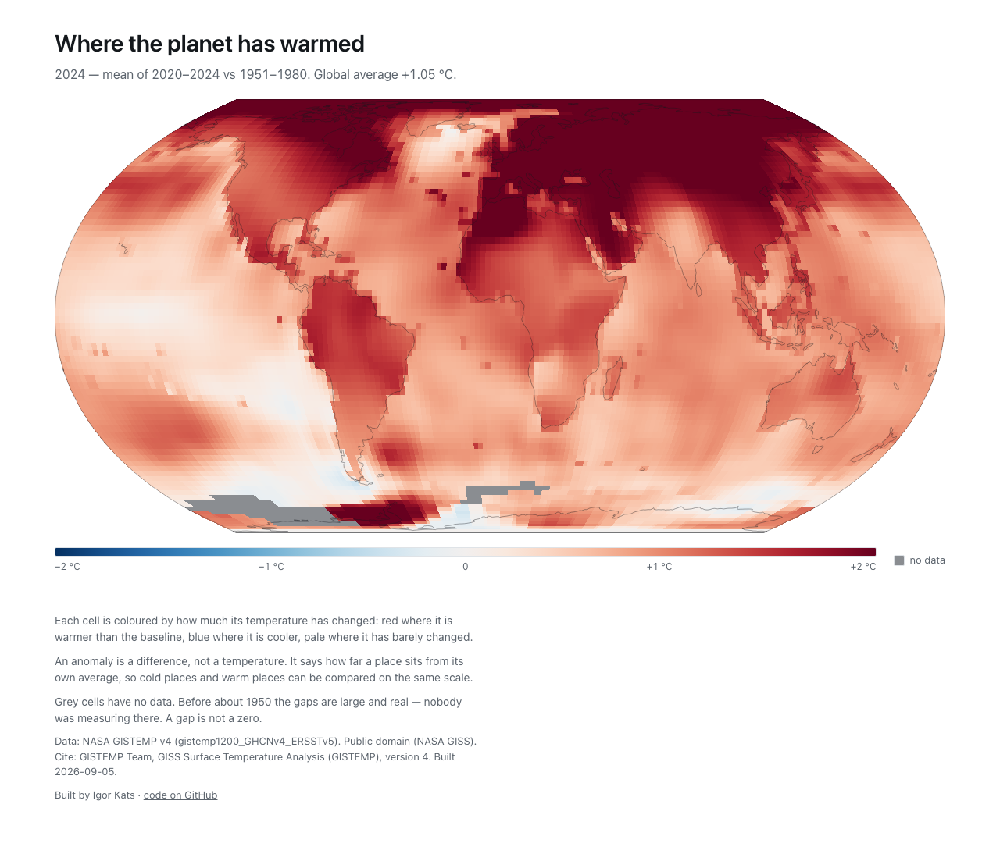

# warming-map

Free, public, animated map of where the planet has warmed most — user-chosen baseline period and rolling window, blue (cooled) → grey → red (warmed). Later: a second layer showing where emissions come from.

No accounts, no tracking, no backend. See [the brief](docs/2026-09-05_warming-map_brief_v1.md).

## Status

Step 2 of 4: the data pipeline, and the map drawn once in its default view —
world, Equal Earth, the mean of 2020–2024 against a 1951–1980 baseline, on a
blue–grey–red ramp clamped at ±2 °C. Controls are step 3.



### What the default view shows

| | |
| --- | --- |
| Global mean, 2020–2024 vs 1951–1980 | **+1.05 °C** |
| Arctic (≥ 66.5°N) | **+2.61 °C** — 2.5× the global figure |
| Tropics (\|lat\| ≤ 23.5°) | +0.86 °C |
| North Atlantic, 45–62°N and 50–10°W | **+0.67 °C** — the warming hole |

Arctic amplification and the North Atlantic warming hole are both legible in the
default view, which is the standard check that an anomaly map is right. The hole
reads as a pale patch south and east of Greenland rather than a blue one: only
two cells there (63°N, 25–27°W) are actually below their baseline, and on a
±2 °C scale a value near zero is near-white by construction.

## Run it

Two toolchains: Python builds the data file, Node serves the site.

```sh
# data (Python 3.12) — writes public/data/gistemp_annual.{bin,json}
python3.12 -m venv .venv
.venv/bin/pip install -r requirements-dev.txt
.venv/bin/python scripts/build_gistemp.py     # downloads ~200 MB from NASA, caches in .cache/
.venv/bin/python -m pytest tests -q

# site
npm install
npm run dev          # http://localhost:5173
npm test             # vitest
npm run typecheck
npm run build        # -> dist/

# screenshots (needs the dev server running)
node scripts/screenshots.mjs
```

The source NetCDF is cached in `.cache/` and is not committed; the two derived
data files in `public/data/` are. `scripts/build_gistemp.py` is deterministic —
the same input always produces the same bytes — so a rebuild that changes
nothing produces no commit.

## Data

`public/data/gistemp_annual.bin` is a flat little-endian **int16** array laid out
`[year][lat][lon]`, where the stored integer is the anomaly in °C × 100 and
`-32768` means missing. `gistemp_annual.json` carries the coordinates, the year
list, the scale and sentinel, and the provenance. Annual means come from the
monthly source under two rules:

- a cell-year needs at least 9 present months, otherwise that cell-year is missing;
- the **last** year in the source is kept only if the file covers all 12 of its
  months, whatever the per-cell counts say. A part-finished year averages only
  the months that have happened, so its mean is seasonally biased and is never
  published as an annual value.

**Pre-1950 gaps are real gaps, not zeros.**

Values are anomalies against 1951–1980, as the source publishes them. A
user-chosen baseline is a re-centring of those anomalies, not a conversion to
absolute temperature.

### Reproducibility

Area-weighted (cos-latitude) global mean anomaly vs 1951–1980, as computed from
the committed binary, against NASA's published GISTEMP values:

| Year | This repo | NASA published | Difference |
| ---- | --------- | -------------- | ---------- |
| 2016 | +1.03 °C  | +1.02 °C       | 0.01       |
| 2020 | +1.01 °C  | +1.02 °C       | 0.01       |
| 2023 | +1.18 °C  | +1.17 °C       | 0.01       |
| 2024 | +1.29 °C  | +1.28 °C       | 0.01       |

Within the ±0.05 °C the brief asks for. The trend over 1980–2025 is
**+0.211 °C/decade**, matching the expected ≈ +0.2 °C/decade.

### Licences

Data: NASA GISTEMP v4 (public domain); ERA5 © ECMWF/Copernicus (CC BY 4.0) in v2; EDGAR (European Commission JRC) in v3. Code: MIT.

Cite GISTEMP as: GISTEMP Team, *GISS Surface Temperature Analysis (GISTEMP), version 4*, NASA Goddard Institute for Space Studies.

### Transfer size

The production build is **4.83 MB raw, 1.86 MB gzipped**, nearly all of it the
data file. `vite preview` compresses the text assets but not the `.bin`, and
GitHub Pages may do the same for `application/octet-stream`. If it does, first
load is 4.7 MB rather than the ~2 MB the brief budgets for, and the fix at
deploy time is to ship the binary pre-compressed and inflate it with
`DecompressionStream` in the browser. Worth settling in step 4.

### Rendering

Each frame is one `ImageData` filled through a pixel → cell lookup built once
per viewport size. Building that lookup by inverting the projection per pixel
costs ~500 ms for a 3.3 Mpx canvas; because Equal Earth is pseudocylindrical
(parallels are canvas rows, and x is exactly linear in longitude along a row)
the lookup inverts once per row instead, at 1.4 ms. `assertPseudocylindrical`
fails loudly if a projection that breaks the assumption is swapped in, and a
test checks the fast path against the slow per-pixel inverse.

## Automation

`.github/workflows/build-data.yml` rebuilds the data on the 20th of each month
(NASA updates around mid-month) and on manual dispatch, and commits the two
files only when the binary actually changed. The site never contacts NASA at
runtime.
